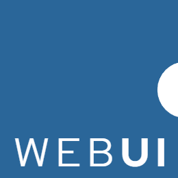
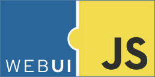
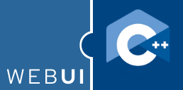

# WebUI Logo Inspiration

The WebUI logo is inspired by [WASM](https://webassembly.org/), especially the `WASM` + `JavaScript` logo, where both are put together as a plug-in. While the WASM logo means "_Run a programming language in the web browser_", the WebUI, on the other hand, means "_Run any programming language from the web browser_".

## 64 x 64

## 128 x 128

## 260 x 260

## WebUI and JavaScript

## WebUI and Zig

## WebUI and Python

## WebUI and Rust

## WebUI and Go

## WebUI and C++

