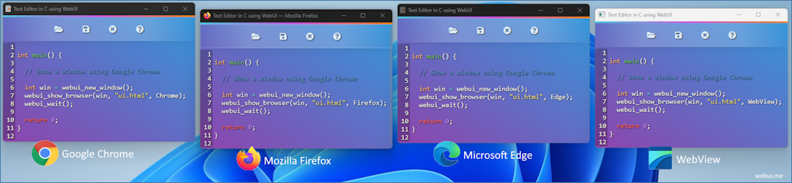

# WebUI Logo Inspiration

The WebUI logo is inspired by [WASM](https://webassembly.org/), especially the `WASM` + `JavaScript` logo, where both are put together as a plug-in. While the WASM logo means "_Run a programming language in the web browser_", the WebUI, on the other hand, means "_Run any programming language from the web browser_".

## Inf

Color: `#2a6699`

Square size: `500px x 500px`

Circle size: `140px x 140px` (_At right midle_)

Text Font: [Red Hat Display ](https://fonts.google.com/specimen/Red+Hat+Display)

## Screenshot

## 120 x 120 (_SVG_)

[webui.svg](webui.svg) (_500 x 500_)

## WebUI and JavaScript

## WebUI and Zig

## WebUI and Python

## WebUI and Nim

## WebUI and Bun

## WebUI and Deno

## WebUI and Swift

## WebUI and V

## WebUI and Rust

## WebUI and Go

## WebUI and Pascal

## WebUI and C++

## WebUI and C#

